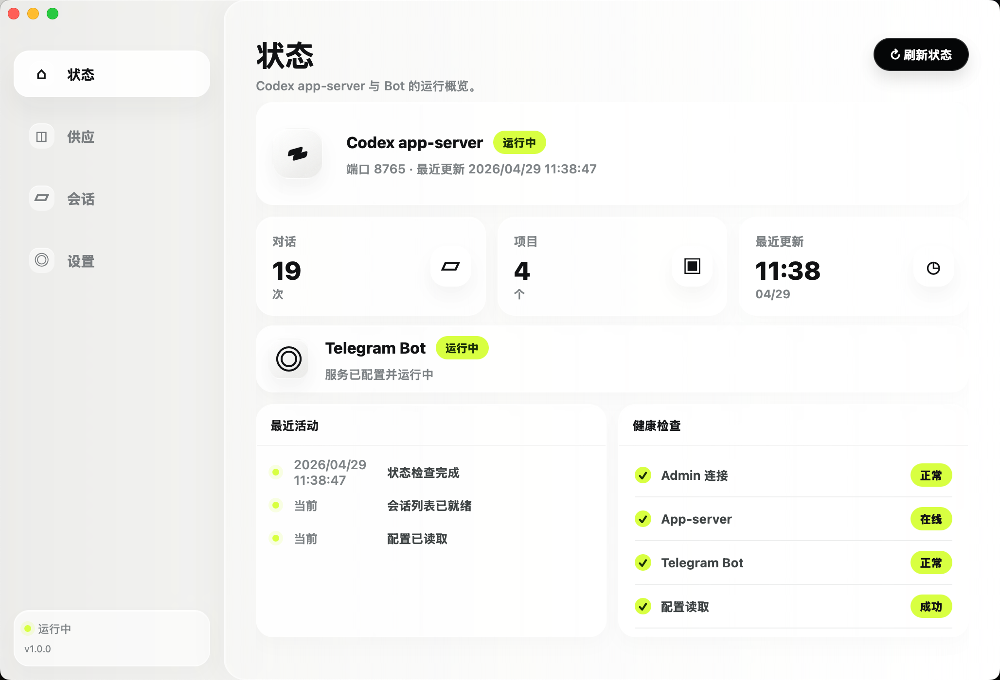

# CodexManager

管理本机 Codex 配置、会话和远程控制的 macOS 桌面应用。支持通过 Telegram Bot 远程与 Codex 交互。



## 功能

- **Codex 供应商管理**：新增、编辑、删除、切换供应商，激活时自动写入 `~/.codex/config.toml` 和 `~/.codex/auth.json`。
- **Codex 会话管理**：通过 Codex app-server 获取、查看和归档会话。
- **Telegram Bot 远程控制**：通过 Telegram 远程与 Codex 对话，支持独立新对话和项目对话。
- **状态监控**：实时查看 Codex app-server 和 Telegram Bot 的运行状态。

## 下载安装

从 [GitHub Releases](https://github.com/panghu310/codex-manager/releases) 下载最新版 `CodexManager.app`。

### macOS 首次打开

未经过 Apple 公证，首次打开可能提示「已损坏，无法打开」。在终端执行：

```sh
xattr -cr /Applications/CodexManager.app
```

如果 App 还在下载目录，路径替换为 `~/Downloads/CodexManager.app`。

### 找不到 codex 命令？

从 Finder/Spotlight 启动的 GUI 应用不会加载 `.zshrc` 中的 `PATH`。如果 Codex 安装在 Homebrew 等路径下，应用会自动搜索以下常见目录：

- `/opt/homebrew/bin`
- `/usr/local/bin`
- `~/.local/bin`

如果仍然找不到，前往**设置**页面手动配置 `Codex 路径`。

## 配置

应用首次运行后会自动在用户目录创建配置文件夹：

```text
~/.codex-manager/config.json
```

所有配置（供应商 + TG Bot）都存储在这个文件中。

### 最小配置

首次使用前，在**设置**页面配置以下项：

| 配置项 | 说明 |
|--------|------|
| **Bot Token** | 从 [@BotFather](https://t.me/botfather) 获取 |
| **允许的用户 ID** | 你的 Telegram 数字 ID，只有这个用户能使用 Bot |
| **Codex 路径** | `codex` 命令的路径，留空则自动从 PATH 查找 |

### 配置文件示例

```json
{
  "telegramBotToken": "your-bot-token",
  "telegramAllowedUserId": "12345678",
  "codexPath": "codex",
  "providers": [
    {
      "id": "openai",
      "name": "OpenAI",
      "baseUrl": "https://api.openai.com/v1",
      "model": "gpt-5.4",
      "apiKey": "sk-..."
    }
  ],
  "activeProviderId": "openai"
}
```

### Telegram Bot 额外说明

- `CODEX_BOT_DROP_PENDING_UPDATES` 默认开启。Bot 每次启动时会丢弃离线期间积压的 update，避免恢复后突然执行旧消息。
- 当前版本由 App 在进程内直接拉起 `telegram-codex-bot` sidecar，不依赖 `launchd` 或 `~/Library/LaunchAgents/*.plist`。

## 本地开发

```sh
npm install
npm run tauri -- dev
```

开发模式会临时启动 Vite 调试端口；打包后的 App 使用内置 `dist` 静态文件，不依赖前端端口服务。

## 打包

```sh
npm run tauri -- build --debug
```

调试版 App 生成位置：

```text
src-tauri/target/debug/bundle/macos/CodexManager.app
```

发布版：

```sh
npm run tauri -- build
```

## 项目结构

| 路径 | 说明 |
|------|------|
| `src/main.js` | 前端入口 |
| `src/status.js` | 前端数据适配 |
| `src/styles.css` | 样式 |
| `src-tauri/src/lib.rs` | Tauri 命令注册 |
| `src-tauri/src/app_server.rs` | Codex app-server 客户端 |
| `src-tauri/src/config.rs` | 统一配置管理 |
| `src-tauri/src/codex_provider.rs` | 供应商管理 |
| `src-tauri/src/bot_settings.rs` | TG Bot 配置与进程控制 |
| `src-tauri/src/bin/telegram-codex-bot.rs` | TG Bot 运行时 |

## 验证

```sh
npm test
cargo test --manifest-path src-tauri/Cargo.toml
npm run tauri -- build --debug
```
